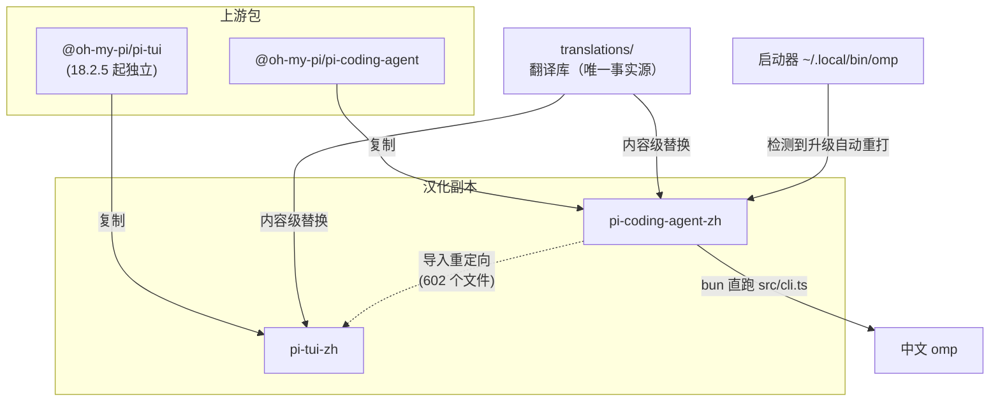

# oh-my-pi-zh

**给 [oh-my-pi](https://github.com/can1357/oh-my-pi)（CLI 名 `omp`）的简体中文汉化**

把 omp 的终端界面、帮助文档与设置面板汉化为简体中文。**非官方项目**——omp 本身没有 i18n 钩子，因此本项目采用源码级翻译。

[](https://github.com/tt1bt/oh-my-pi-zh/releases/latest)
[](https://www.npmjs.com/package/omp-zh)
[](LICENSE)

当前基线：**omp 18.2.5** · 翻译条目 **2515** 条 · 命中 **3292** 处


---

## 目录

- [这是什么](#这是什么)
- [特性](#特性)
- [工作原理](#工作原理)
- [安装](#安装)
  - [方式一：npm（推荐）](#方式一npm推荐)
  - [方式二：一行脚本](#方式二一行脚本)
  - [方式三：手动（开发用）](#方式三手动开发用)
  - [常用参数](#常用参数)
  - [验证安装](#验证安装)
- [升级与自愈](#升级与自愈)
- [卸载](#卸载)
- [兼容性与已知限制](#兼容性与已知限制)
- [常见问题](#常见问题)
- [项目结构](#项目结构)
- [维护者指南](#维护者指南)
  - [跟进上游新版本](#跟进上游新版本)
  - [翻译库格式](#翻译库格式)
  - [发布到 npm](#发布到-npm)
  - [发布 GitHub Release](#发布-github-release)
  - [刻意保留英文的原则](#刻意保留英文的原则)
- [许可](#许可)

---

## 这是什么

omp 没有本地化机制，所以无法通过插件或配置切换语言。本项目的做法是**复制一份源码、替换其中的字符串、再运行这份副本**：

1. 把已安装的 `@oh-my-pi/pi-coding-agent` 复制为 `pi-coding-agent-zh`
2. 按翻译库（`translations/*.jsonc`）做**内容级**字符串替换
3. 用 bun 直接运行汉化后的 TypeScript 源码

原包全程只读，随时可卸载。

> **自 omp 18.2.5 起为双包模式。** 上游把 UI 层抽成了独立包 `@oh-my-pi/pi-tui`，因此汉化同时处理两个包（`pi-coding-agent-zh` 与 `pi-tui-zh`），并把主包副本中对 `@oh-my-pi/pi-tui` 的导入重定向到汉化副本。详见[工作原理](#工作原理)。

## 特性

- **全中文 TUI**：欢迎横幅、小贴士、状态栏、设置面板、工具执行渲染、选择器 / 向导 / 审批提示
- **中文帮助**：`omp --help` 及全部子命令的 flags / args / examples
- **中文 `/help`**：快捷键表、计划审批选项、新手引导
- **约 2500 条翻译**：专有名词（Git / LSP / MCP / API / token 等）按惯例保留英文
- **自愈启动器**：omp 升级后首次启动自动重打汉化，无需手动操作
- **内容级匹配**：按字符串内容而非行号匹配，上游小版本升级后绝大多数翻译直接命中
- **失败安全**：失配条目局部退化为英文，不影响程序运行，且会在报告中明确列出

## 工作原理



三个核心机制：

**翻译库是唯一事实源。** 所有文案都在 `translations/` 里，脚本不写死任何字符串。改翻译只需改 JSON，不需要碰代码。

**内容级匹配。** 条目按"字面量内容"匹配，而非行号或补丁上下文。因此上游升级导致行号漂移时，翻译依然命中；确实失配的条目会被列出来，局部退化为英文而不报错。

**双包重定向。** 主包副本里对 `@oh-my-pi/pi-tui` 的导入被改写成 `@oh-my-pi/pi-tui-zh`，否则界面会一半中文一半英文（主包汉化了，UI 层还是原版）。

## 安装

### 方式一：npm（推荐）

```bash
bun install -g omp-zh
```

装完直接敲 `omp` 就是中文界面。不需要 clone 仓库、不需要 git、不需要任何配置。

```bash
bun install -g omp-zh@latest   # 升级
bun remove -g omp-zh           # 卸载
```

版本号与上游 omp 对齐（如 `18.2.5`），一眼看出对应哪个上游版本。

> **首次启动会略慢。** 包内以 `vendor/` 内联了汉化后的 pi-tui，首次运行时需要把它物化到 `node_modules`（bun 不支持 `bundledDependencies`，这是让双包可靠工作的方式）。之后启动正常，约 4–5 秒（bun 直跑 TS 源码，未打包）。

### 方式二：一行脚本

不需要 npm，也不需要 git。

**Windows（PowerShell）**

```powershell
irm https://raw.githubusercontent.com/tt1bt/oh-my-pi-zh/main/install.ps1 | iex
```

**macOS / Linux**

```bash
curl -fsSL https://raw.githubusercontent.com/tt1bt/oh-my-pi-zh/main/install.sh | sh
```

脚本会自动：

1. 检查 bun（未安装会给出安装命令）
2. 把本仓库下载到 `~/.oh-my-pi-zh`（**不需要 git**）
3. 若本机还没装 omp，自动 `bun add -g @oh-my-pi/pi-coding-agent@latest`
4. 应用汉化，并在 `~/.local/bin` 安装 `omp` 启动器

重复执行同一条命令即为**更新**。

### 方式三：手动（开发用）

前置：[bun](https://bun.sh) ≥ 1.3.14，且 omp 已全局安装。

```bash
git clone https://github.com/tt1bt/oh-my-pi-zh.git
cd oh-my-pi-zh

./apply.sh        # macOS / Linux
.\apply.ps1       # Windows
bun scripts/apply.ts   # 三种入口等价
```

### 常用参数

`apply.ts` 的参数（`apply.ps1` / `apply.sh` / `apply.cmd` 均会转发）：

| 参数 | 作用 |
|---|---|
| `--check` | 预演模式：统计翻译命中率，**不修改任何文件** |
| `--force` | 版本一致时也强制重打 |
| `--no-auto-heal` | 启动器不做版本自愈检查 |
| `--quiet` | 精简输出 |
| `--bun-global <path>` | 手动指定 bun 全局 `node_modules` |
| `--launcher-dir <path>` | 手动指定启动器安装目录 |
| `--source <path>` | 维护者用：对指定主包源码目录预演 |
| `--source-tui <path>` | 维护者用：对指定 pi-tui 源码目录预演 |

`install.ps1` 参数：`-Dir <路径>`、`-Ref <分支/标签>`、`-NoApply`、`-Help`。
`install.sh` 参数：`--dir <路径>`、`--ref <分支/标签>`、`--no-apply`。
管道执行时要传参，写成 `curl ... | sh -s -- --dir ~/oh-my-pi-zh`。

### 验证安装

```bash
omp --help    # 应显示中文 flag 描述
omp           # 欢迎横幅应为中文
```

若敲 `omp` 仍是英文，多半是启动器目录不在 PATH 中或排在 bun 的 bin 之后——见[常见问题](#常见问题)。

## 升级与自愈

启动器每次启动时会比对**已安装 omp 版本**与**汉化副本的版本标记**：

- **版本一致** → 直接启动，零开销
- **已升级** → 自动重打一次汉化（通常几秒），然后启动

双包模式下会同时比对两个包的版本。自动重打需要本仓库仍在安装时记录的路径；若仓库被移动或删除，会给出提示而不是报错，并以最后一次汉化版本启动。

也可以随时手动重跑：

```bash
./apply.sh --force
```

## 卸载

**npm 安装**

```bash
bun remove -g omp-zh
```

**一行脚本安装**

```powershell
Remove-Item -Recurse -Force "$HOME\.oh-my-pi-zh"   # 下载的仓库
Remove-Item "$HOME\.local\bin\omp.cmd"             # 启动器
```

**手动安装**

```powershell
# 删除汉化副本（双包模式有两个）
Remove-Item -Recurse -Force "$HOME\.bun\install\global\node_modules\@oh-my-pi\pi-coding-agent-zh"
Remove-Item -Recurse -Force "$HOME\.bun\install\global\node_modules\@oh-my-pi\pi-tui-zh"
# 删除启动器
Remove-Item "$HOME\.local\bin\omp.cmd"
```

> 原包全程只读。删除启动器后，PATH 中 bun 的原始 `omp.exe` 即恢复生效。

## 兼容性与已知限制

- 翻译库基线为 **omp 18.2.5**。该版本下 2515 条条目中 3292 处命中、1 处未命中。
- **双包模式**：omp 18.2.5 起上游把 UI 层抽成 `@oh-my-pi/pi-tui`，汉化同时处理两个包。旧版 omp（无 pi-tui）会自动退化为单包模式。
- **启动耗时**约 4–5 秒（bun 直跑 TS 源码，未打包）。
- **已知遗留**：
  - `pi-tui/src/tools/json-tree.ts` 有 1 条旧变量名文案未命中，该处局部保持英文
  - `src/config/settings-schema.ts` 仍有部分设置项长描述为英文（历史遗留，欢迎 PR）
  - `omp --help` 的 Environment Variables 整块仍为英文（体量大且以技术名称为主）
- 模型侧提示词（如 `src/prompts/system/*.md`）与工具返回给模型的内容完全保留英文，这是有意为之——汉化会改变模型行为。

## 常见问题

**敲 `omp` 还是英文？**

检查启动器目录是否在 PATH 中，且排在 bun 的 bin 之前：

```powershell
$env:PATH -split ';' | Select-String 'local\\bin|\.bun\\bin'
```

若 `~/.local/bin` 不在其中，把它加入用户级 PATH（并确保在 `~/.bun/bin` 之前），然后**新开一个终端**——PATH 改动不会影响已打开的会话。

**汉化后界面一半中文一半英文？**

说明 pi-tui 汉化未生效。确认 `pi-tui-zh` 副本存在且主包副本中的导入已重定向：

```bash
bun scripts/apply.ts --force
```

**首次启动特别慢？**

npm 安装方式下，首次启动需要把内联的 pi-tui 物化到 `node_modules`，之后恢复正常。

**上游又发新版了怎么办？**

启动器会自动重打。若想手动控制，先升级 omp 再重跑 apply：

```bash
bun add -g @oh-my-pi/pi-coding-agent@latest
bun add -g @oh-my-pi/pi-tui@latest
./apply.sh --force
```

## 项目结构

```
oh-my-pi-zh/
├── translations/              # 翻译库（唯一事实源）
│   ├── cli.jsonc              #   命令行 / 帮助文本
│   ├── commands.jsonc         #   子命令
│   ├── settings.jsonc         #   设置项
│   ├── modes.jsonc            #   TUI 界面
│   ├── tools.jsonc            #   工具渲染
│   ├── tui.jsonc              #   TUI 组件（根目录遗留）
│   ├── snippets.jsonc         #   结构性代码补丁
│   ├── excluded.jsonc         #   刻意不翻译的范围
│   ├── meta.jsonc             #   基线版本
│   └── tui/                   #   pi-tui 包专属条目
├── scripts/
│   ├── apply.ts               # 应用汉化（用户侧主入口）
│   ├── extract.ts             # 生成缺口报告（维护侧）
│   ├── gen-patch.ts           # 再生审计补丁
│   ├── build-npm-pkg.ts       # 构建 npm 包
│   ├── migrate.ts             # 从旧补丁反推翻译库（一次性工具）
│   └── lib/                   # 引擎层：扫描器、替换器、diff、类型
├── .github/workflows/
│   ├── publish-npm.yml        # 发布到 npm（Trusted Publishing）
│   └── upstream-check.yml     # 每周检查上游版本
├── apply.ps1 / .sh / .cmd     # 平台入口（转发到 scripts/apply.ts）
├── install.ps1 / .sh          # 一行安装脚本
├── hanhua.patch               # 主包汉化 diff（审计用）
└── hanhua-tui.patch           # pi-tui 汉化 diff（审计用）
```

## 维护者指南

### 跟进上游新版本

上游迭代很快，本项目为此构建了完整工具链（全部零依赖，bun 直跑）。

```bash
# 1. 生成缺口报告（A 失效 / B 漂移 / C 新增）
bun scripts/extract.ts --version <新版>
#    报告写入 .tmp/extract-report-<新版>.json

# 2. 按报告修改 translations/*.jsonc
#    注意：B 类"漂移串"可能是 diff 对齐造成的假阳性，需逐条实证核对

# 3. 预演覆盖率（应零未命中）
bun scripts/apply.ts --check --source <主包目录> --source-tui <pi-tui 目录>

# 4. 再生审计补丁
bun scripts/gen-patch.ts --source <主包目录> --source-tui <pi-tui 目录>

# 5. 更新 translations/meta.jsonc 的 baseVersion，提交
```

> **注意**：`extract.ts` 目前只扫描主包，尚未适配双包。跟进前需手工核对 pi-tui 侧的缺口。

处理"失效条目"时的关键判断：**多数失效是归属漂移，不是删除**。原文可能一字未改，只是随代码搬到了 pi-tui 的其他文件。按字面删除会丢掉汉化——必须先在两个包的全部源文件中确认原文确实无处存活，才能删除；否则应改 `file` 与 `pkg` 保留译文。

### 翻译库格式

条目按界面区域拆分，**每行一条 JSON**，git diff 友好。区域文件由脚本按 `src/` 前缀自动归类生成，无需手工新建。

包归属通过**所在目录**或**条目内的 `pkg` 字段**决定：

- `translations/*.jsonc` → 默认属于主包（`agent`）
- `translations/tui/*.jsonc` → 属于 pi-tui
- 条目内显式写 `"pkg":"tui"` → 覆盖默认值（用于同文件内混合归属的场景）

条目类型：

| kind | 匹配方式 | 用途 |
|---|---|---|
| `string` | 引号内内容完全一致 | 普通显示文案 |
| `template` | 模板字面量，`${...}` 槽位表达式须一致 | 带插值的文案 |
| `line` | 整行精确匹配 | 与代码纠缠的翻译 |
| `snippet` | 精确文本锚点查找替换 | 新增代码块 / 删行 |
| `asset` | 整文件替换 | `tips.txt` 等纯文本资产 |

`context`（行骨架）、`occurrence`（第几次出现）、`span`（行内第几个同内容串）用于消歧：同一英文串在文件里既作显示值又作比较键时，只翻译显示的那处。

### 发布到 npm

前置：本机已 `npm login` 到**官方源**。若 `~/.npmrc` 指向 npmmirror 等镜像，发布时必须显式加 `--registry https://registry.npmjs.org`。

```bash
# 1. 构建（产物在 .tmp/npm-pkg/omp-zh）
bun scripts/build-npm-pkg.ts --version <omp版本> --tui-source <pi-tui目录> --strict-baseline

# 2. 本地试装验证（强烈建议）
cd .tmp/npm-pkg/omp-zh && npm pack
#    再把 tgz 装进任意临时项目：bun add <tgz>，然后看 omp --help 是否中文

# 3. 发布
cd .tmp/npm-pkg/omp-zh
npm publish --registry https://registry.npmjs.org --access public
```

关键点：

- `--strict-baseline`：`baseVersion` 与目标版本不一致时**拒绝构建**，避免把"大面积仍是英文"的包发出去
- `--tui-source`：指定已解包的 pi-tui 目录，供内联进包；省略时会尝试按同版本从 npm 拉取
- 发布包的 `bin` 指向 `bin/omp.mjs`（bun 直跑汉化后的 `src/cli.ts`）；包内 `dist/cli.js` 是上游原版，仅为兼容保留
- 构建脚本会改写 `package.json`（包名 / 版本 / bin / 描述 / 仓库）并**删除上游的 `scripts`**——其中的 `prepack` 会在 `npm publish` 时触发构建且必然失败

**关于 2FA**：npm 从 2025-11 起移除 Classic token，只能用 Granular token。开了 2FA 的账号要么补 `--otp`，要么建一个勾了 **Bypass 2FA** 的 token。注意 npm 计划 2027-01 起废弃该方式，所以 CI 请用下面的 Trusted Publishing。

#### CI 自动发布（Trusted Publishing）

`.github/workflows/publish-npm.yml` 支持手动触发（Actions → publish-npm → Run workflow）或推送 `v*` tag 触发，认证走 GitHub OIDC，**不需要任何 token**。

需先在 npm 包页面配置一次 Trusted Publisher（npmjs.com → 包 `omp-zh` → Settings → Trusted Publisher → GitHub Actions）：

| 字段 | 值 |
|---|---|
| Organization or user | `tt1bt` |
| Repository | `oh-my-pi-zh` |
| Workflow filename | `publish-npm.yml` |
| Environment name | 留空 |
| Allowed actions | **必须勾上 `npm publish`** |

> ⚠️ npm 从 2026-09-03 起，新建的 Trusted Publisher 配置**默认只允许 `npm stage publish`（暂存待审）**。不勾上直接 `npm publish`，CI 会在发布那一步失败。

其它要求：npm CLI ≥ 11.5.1、Node ≥ 22.14.0；`repository.url` 必须与 GitHub 仓库完全一致（构建脚本已保证）。仓库与包均公开时，npm 会自动生成 provenance 证明。

工作流带**两道安全阀**：只有 `baseVersion` 等于目标版本时才真正发布；目标版本若已存在则跳过发布（因此打 tag 与手动触发指向同一版本时不会因重复发布而失败）。

### 发布 GitHub Release

```bash
# 附件取 registry 官方 tarball（勿用本地 npm pack——本地重打包字节与线上不一致）
curl -L -o omp-zh-<版本>.tgz https://registry.npmjs.org/omp-zh/-/omp-zh-<版本>.tgz
# 校验 sha1 与 npm 的 dist.shasum 一致后再上传

gh release create v<版本> \
  --title "omp 简体中文汉化 v<版本>" \
  --notes-file <说明> \
  "omp-zh-<版本>.tgz#omp-zh-<版本>.tgz" \
  "hanhua.patch#hanhua.patch" \
  "hanhua-tui.patch#hanhua-tui.patch" \
  --latest
```

### 刻意保留英文的原则

汉化遵循"只翻译给人看的文本"这一原则：

**保留英文**（汉化会改变行为或造成故障）：

- **模型侧内容**：工具 schema 描述、工具返回给模型的文本、系统提示词
- **与程序精确匹配的字符串**：比较键、API 参数值（如 `detail: "metadata"`）、设置项的 `value` / `tab` 键
- **运行时日志**：`logger.*` 输出、RPC 内部错误

**照常翻译**：CLI 子命令名、用法示例、键位提示（`Enter` / `Esc` / `Tab`）、品牌名与环境变量名按惯例保留原文。

当同一英文串既作显示值又作比较键时（"双轨"字符串），由 `context` / `span` 限定只翻译显示的那处。

## 许可

[MIT](LICENSE)。翻译内容与脚本基于 [oh-my-pi](https://github.com/can1357/oh-my-pi)（MIT）派生，感谢原项目作者。
