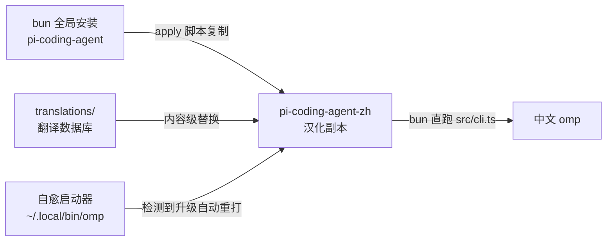

# oh-my-pi-zh — omp 简体中文汉化补丁


汉化主界面


汉化设置界面

将 [oh-my-pi](https://github.com/can1357/oh-my-pi) (omp) CLI 的终端界面汉化为简体中文。

> **这不是官方插件。** omp 目前没有 i18n/本地化钩子，因此本项目以**源码级翻译**方式工作：
> 把已安装的 `@oh-my-pi/pi-coding-agent` 源码包复制一份为 `-zh` 副本，按翻译数据库做内容级替换，再用 bun 直接运行汉化后的 TypeScript 源码。

## 特性

- 全中文 TUI：欢迎横幅、小贴士、状态栏、设置界面、工具执行渲染、选择器/向导/审批提示
- 中文 `omp --help` 及全部子命令帮助（flags/args/examples）
- 中文 `/help` 快捷键表、计划审批选项、新手引导
- 约 2500 条字符串翻译，专有名词（Git/LSP/MCP/API/token 等）按惯例保留英文
- **自愈启动器**：omp 升级后首次启动自动重打汉化，无需手动操作
- **内容级匹配**：翻译按字符串内容而非行号应用，omp 小版本升级后绝大多数翻译直接命中
- 原包不受影响，可随时卸载

## 工作原理



- **翻译数据库**（`translations/*.jsonc`）是唯一事实源：约 2500 条 en→zh 条目 + 9 处结构性代码补丁。
- **内容级替换**：条目按"字面量内容"（而非行号/补丁上下文）匹配，omp 升级后行号漂移不影响命中；失配的条目会被明确列出，局部退化为英文而不报错。
- 汉化版每次启动约 4–5 秒（bun 直跑 TS 源码，未打包）。

## 安装

### 前置

- [bun](https://bun.sh) ≥ 1.3.14
- omp 已全局安装：`bun add -g @oh-my-pi/pi-coding-agent`
- 本仓库（`git clone` 后无需其他依赖，补丁应用不再需要 git/patch 二进制）

### Windows

```powershell
git clone https://github.com/tt1bt/oh-my-pi-zh.git
cd oh-my-pi-zh
.\apply.ps1
```

### macOS / Linux

```bash
git clone https://github.com/tt1bt/oh-my-pi-zh.git
cd oh-my-pi-zh
./apply.sh
```

也可以直接 `bun scripts/apply.ts`（两种入口等价）。

脚本会自动：
1. 定位 bun 全局 `node_modules`
2. 复制 `pi-coding-agent` → `pi-coding-agent-zh` 并应用翻译数据库
3. 在 `~/.local/bin` 安装 `omp` 启动器（该目录在 PATH 中且排在 `.bun\bin` 之前时，直接敲 `omp` 即为汉化版）

### 常用参数

| 参数 | 作用 |
|---|---|
| `--check` | 预演模式：统计当前 omp 版本的翻译命中率，不修改任何文件 |
| `--force` | 版本一致时也强制重打 |
| `--no-auto-heal` | 启动器不做版本自愈检查 |
| `--bun-global <path>` / `--launcher-dir <path>` | 手动指定 bun 全局目录 / 启动器安装目录 |

### 验证

```bash
omp --help          # 应显示中文 flag 描述
omp                 # 欢迎横幅应为中文
```

## 自愈：omp 升级后

启动器会在每次启动时比对已安装 omp 版本与汉化副本的版本标记：

- **版本一致** → 直接启动，零开销
- **omp 已升级** → 自动重打一次汉化（内容级替换，通常几秒），然后启动

自动重打需要本仓库仍在安装时记录的路径；若仓库被移动/删除，会提示而不是报错，并以最后一次汉化版本启动。也可以随时手动重跑 `.\apply.ps1` / `./apply.sh`。

## 卸载

```powershell
# 删除汉化副本
Remove-Item -Recurse -Force "$HOME\.bun\install\global\node_modules\@oh-my-pi\pi-coding-agent-zh"
# 删除启动器
Remove-Item "$HOME\.local\bin\omp.cmd"
# 还原 omp(删除启动器后,PATH 中 bun 的原始 omp.exe 即恢复生效)
```

## 维护者指南：跟进新版本

上游迭代很快，本项目为此构建了完整的工具链（全部零依赖，bun 直跑）：

```bash
# 1. 生成新版本缺口报告（失效条目 / 漂移串 / 新增未译）
bun scripts/extract.ts --version <新版>      # 报告写入 .tmp/extract-report-<新版>.json

# 2. 按报告翻译：更新 translations/*.jsonc
#    B 类"漂移串"优先（曾被翻译的原文变了），其次 C 类"新增"，A 类"失效"做清理

# 3. 预演覆盖率
bun scripts/apply.ts --check --source <新版源码目录>

# 4. 再生审计补丁（可选，向后兼容 git apply -p2 用法）
bun scripts/gen-patch.ts --version <新版>

# 5. 更新 translations/meta.jsonc 的 baseVersion，提交
```

### translations/ 数据格式

- `cli.jsonc` / `commands.jsonc` / `tools.jsonc` / `modes.jsonc` / `settings.jsonc` / `tui.jsonc`：按界面区域拆分的条目，每行一条 JSON，git diff 友好（区域文件由脚本按 `src/` 前缀自动归类生成，无需手工新建）
- `snippets.jsonc`：结构性代码补丁（如中文量词表、状态标签函数），按精确文本锚点定位
- `excluded.jsonc`：刻意不翻译的范围（模型侧内容、截图素材等）
- `meta.jsonc`：基线版本等元信息

条目类型：

| kind | 匹配方式 | 用途 |
|---|---|---|
| `string` | 引号内内容完全一致（可带行骨架/行内序号限定） | 普通显示文案 |
| `template` | 模板字面量，`${...}` 槽位表达式须一致 | 带插值的文案 |
| `line` | 整行精确匹配 | 与代码纠缠的翻译 |
| `snippet` | 精确文本锚点查找替换 | 新增代码块/删行 |
| `asset` | 整文件替换 | tips.txt 等纯文本资产 |

`context`（行骨架）与 `span`（行内第几个同内容串）用于消歧：同一英文串在文件里既作显示值又作比较键时，只翻译显示的那处。

### 刻意保留英文的部分（原则）

- **工具 schema 描述与发给模型的返回值**（模型侧内容）——汉化会改变模型行为
- **与程序精确匹配的字符串**：比较键（如 `output-meta.ts` 的截断通知、grep 的 `"No matches found"` 判断值、设置项的 `value`/`tab` 键）一律保留原文；对应的**显示值**照常翻译（"双轨"字符串由 context/span 消歧保证）
- 日志、运行时诊断输出

## 兼容性与已知限制

- 翻译库当前基线为 **omp 18.1.17**（`translations/meta.jsonc`），该版本下翻译条目零未命中。新版本发布后运行 `bun scripts/apply.ts`（或直接启动 omp 触发自愈）即可：命中的照常生效，未命中的局部保持英文并可在 `apply` 输出与 `extract` 报告中看到明细。
- 模型侧提示词（如 `src/prompts/system/plan-mode-active.md`）与工具返回给模型的内容（如 `src/tools/context-notes.ts` 的 `text`）完全保留英文，与"模型侧保留"原则保持一致。
- 汉化版每次启动约 4–5 秒（bun 直跑 TS 源码，未打包）。

## 许可

[MIT](LICENSE)。翻译内容与脚本基于 [oh-my-pi](https://github.com/can1357/oh-my-pi)(MIT) 项目派生，感谢原项目作者。
