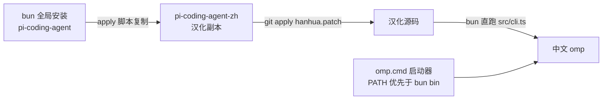

# oh-my-pi-zh — omp 简体中文汉化补丁

将 [oh-my-pi](https://github.com/can1357/oh-my-pi) (omp) CLI 的终端界面汉化为简体中文。

> **这不是官方插件。** omp 目前没有 i18n/本地化钩子,因此本项目以**源码级补丁**方式工作:
> 复制已安装的 `@oh-my-pi/pi-coding-agent` 源码包,应用翻译补丁,再用 bun 直接运行汉化后的 TypeScript 源码。

## 特性

- 全中文 TUI:欢迎横幅、小贴士、状态栏、设置界面、工具执行渲染、选择器/向导/审批提示
- 中文 `omp --help` 及全部子命令帮助(flags/args/examples)
- 中文 `/help` 快捷键表、计划审批选项、新手引导
- 约 2500 条字符串翻译,专有名词(Git/LSP/MCP/API/token 等)按惯例保留英文
- 一键应用 + 版本检测,omp 更新后重跑即可恢复汉化
- 原包不受影响,可随时卸载

## 覆盖范围

| 界面 | 状态 |
|---|---|
| `omp --help` 主帮助 + 33 个子命令帮助 | ✅ |
| 欢迎横幅 / tips / 最近会话 / LSP 区 | ✅ |
| 设置界面(10 Tab、53 分组、1700+ 设置项) | ✅ |
| 工具执行渲染(read/bash/write/grep/glob/ask/task/hub/browser 等 30+ renderer) | ✅ |
| 计划审批、MCP 向导、/btw、/omfg、/advisor、新手引导 | ✅ |

**刻意保持英文的部分**(避免破坏功能或模型行为):
- 工具 schema 描述与发给模型的返回值(模型侧内容)
- 与程序精确匹配的字符串(`output-meta.ts` 的截断通知、"No matches found" 等)
- 通用 "Yes/No" 确认对话框(内部按 `=== "Yes"` 比较)
- 日志、运行时诊断输出

## 工作原理



- `omp` 命令由 bun 的 bin shim 指向打包产物 `dist/cli.js`;汉化版用一个 `.cmd`/`sh` 启动器指向汉化副本的 `src/cli.ts`,bun 原生运行 TS,无需重新打包。
- 补丁为统一 diff 格式,`-p2` 应用,包含所有汉化改动,可审计、可回滚。

## 安装

### 前置

- [bun](https://bun.sh) ≥ 1.3.14
- omp 已全局安装:`bun add -g @oh-my-pi/pi-coding-agent`
- git(补丁应用需要;Windows 用 Git for Windows)

### Windows

```powershell
git clone https://github.com/tt1bt/oh-my-pi-zh.git
cd oh-my-pi-zh
.\apply.ps1
```

脚本会自动:
1. 定位 bun 全局 `node_modules`
2. 复制 `pi-coding-agent` → `pi-coding-agent-zh` 并应用补丁
3. 在 `~/.local/bin` 创建 `omp.cmd` 启动器(该目录在 PATH 中且排在 `.bun\bin` 之前时,直接敲 `omp` 即为汉化版)

### macOS / Linux

```bash
git clone https://github.com/tt1bt/oh-my-pi-zh.git
cd oh-my-pi-zh
./apply.sh
```

启动器安装到 `~/.local/bin/omp`(确保该目录在 PATH 中且排在 bun bin 之前)。

### 验证

```bash
omp --help          # 应显示中文 flag 描述
omp                 # 欢迎横幅应为中文
```

## 更新 omp 后

omp 升级后汉化会失效,重跑一次应用脚本即可(脚本内置版本检测):

```powershell
.\apply.ps1         # 或 ./apply.sh
```

## 卸载

```powershell
# 删除汉化副本
Remove-Item -Recurse -Force "$HOME\.bun\install\global\node_modules\@oh-my-pi\pi-coding-agent-zh"
# 删除启动器
Remove-Item "$HOME\.local\bin\omp.cmd"
# 还原 omp(删除启动器后,PATH 中 bun 的原始 omp.exe 即恢复生效)
```

## 兼容性与已知限制

- 补丁基于 **omp 17.2.9** 生成。新版本若界面文案变更,补丁可能部分失效;应用失败时会明确报错,不会破坏原包。
- 汉化版每次启动约 4–5 秒(bun 直跑 TS 源码,未打包)。
- 会话导出/共享的 UI 文本为中文。

## 许可

[MIT](LICENSE)。翻译内容与脚本基于 [oh-my-pi](https://github.com/can1357/oh-my-pi)(MIT) 项目派生,感谢原项目作者。
